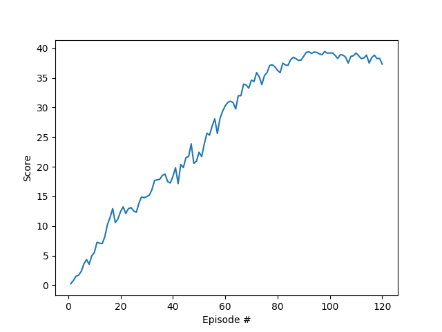

### Report for my Solution on: Deep Reinforcement Learning Nanodegree on Udacity - Project#2: "Continuous Control"

#### 1. Environment
The Given Environment "Reacher_multi.app" has the following structure:

States: 33 float numbers
Actions: 4 contiuous actions (values between -1 and 1)

#### 2. Learning Algorithm
The used Algorithm is a Deep-Deterministic-Policy-Gradient (DDPG)
DDPG is an actor-critic, model-free algorithm that can easily adapt to continuous action spaces.
DDPG uses two neural networks, one as the actor and the other one as the critic. The Actor gets the current state as input and outputs a continuous value for the action. Hereby, the actor uses a stochastic behaviour. The critic on the other hand estimates a Q-Value based on the current state and the chosen action and uses a temporal-difference method to do so. 

<b>The DDPG-Algorithm:</b>

For a more complete instruction of the algorithm, see: https://arxiv.org/pdf/1509.02971.pdf

Multiple Agents where used (The MultiAgent-Environment has 20 Agents)
The Agents pushed their observations into a shared Replay Buffer, what dramatically increases the exploration ability of the Algorithm.

Every 20 Time-Steps, the Agents take 10 learning steps. 

#### 3. Hyperparameters
The Agents was trained with the following Hyperparameters:

BUFFER_SIZE (Replay-Buffer): 1000000
BATCH_SIZE (Batch lenght of Replay-Buffer Experience): 128
GAMMA (Discount Factor): 0.99
TAU (Soft-Update Parameter): 0.001
LR_ACTOR (Actor Learning Rate): 0.0003
LR_CRITIC (Critic Learning Rate: 0.0003
WEIGHT_DECAY (L2 Loss Weight Decay): 0

#### 4. Neural Network
The Neural Network for DDPG-Actor was:

Linear (Fully-Connected Layers) with units:
input_state[33] -> linear[400] -> linear[300] ->out[4]

The Neural Network for the DDPG-Critic was:
Linear (Fully-Connected Layers) with units:
input_state[33] -> linear_concat_with_actions[400 + 4] -> linear[300] -> out[1]

#### 5. Results
After 120 Episodes, the Agents scored 30.00 points on Average over a time-window of 100 Episodes

<b>PLEASE SEE result_log.txt for detailed Result Values</b>

#### 6. Future Improvements
- The Models of the Actor and the Critic can be optimized further
- The Replay Buffer could be further improved by using prioritized sampling instead of randomly sampling batches
- A N-Step return could be implemented instead of one-step temporal difference